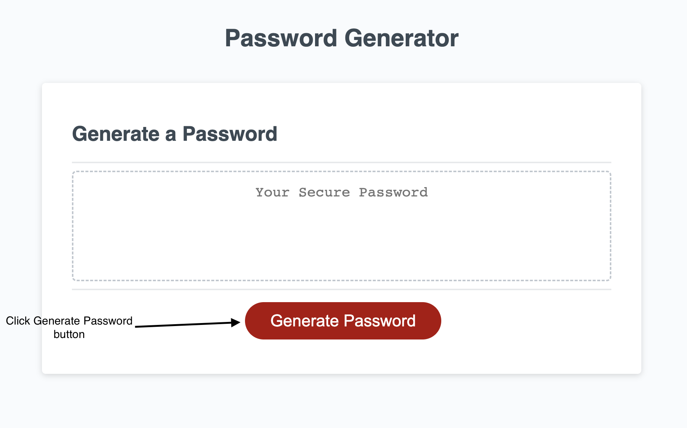
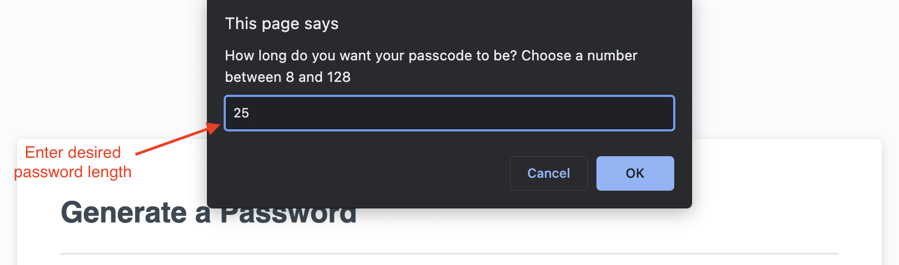
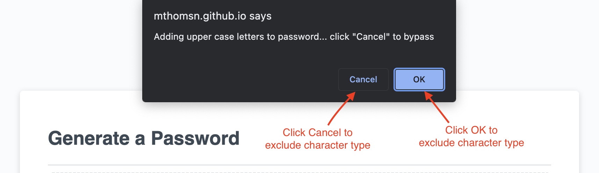
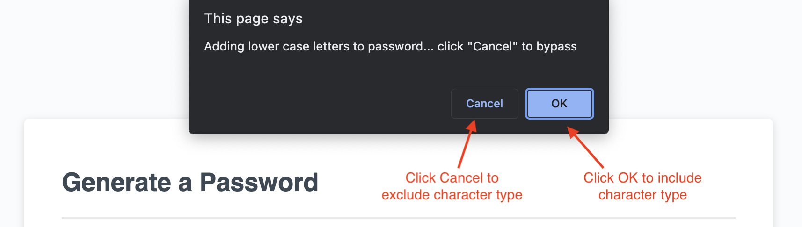
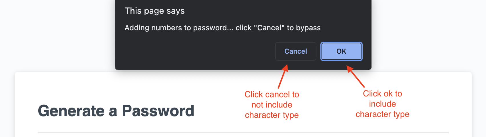
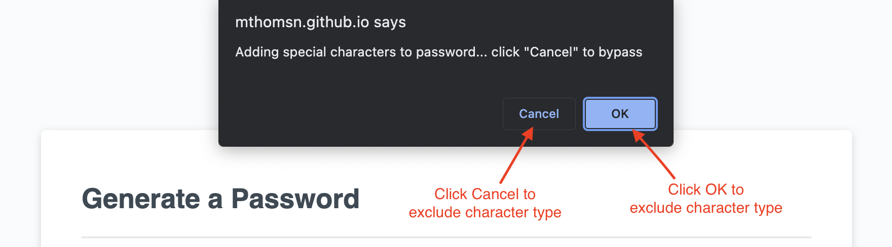
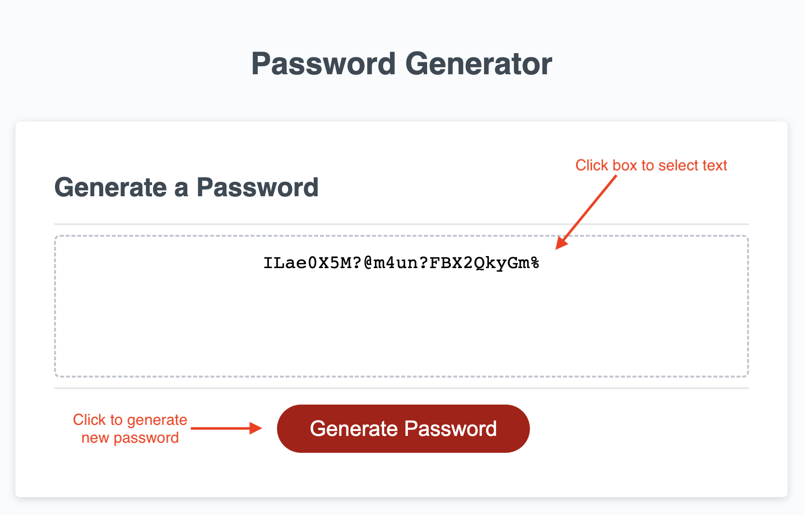

# challenge-3

<!-- link github and deployed application -->
#### __[Deployed Application](https://mthomsn.github.io/challenge-3/)__ 
#### __[GitHub Repository](https://github.com/mthomsn/challenge-3)__

<!-- description -->
## Description
The purpose of this challenge was to use Javascript to create a randomized password based on user input. I started out with outlining what I wanted Javascript to do, and then I pseudo coded some basic logic.  The biggest challenge I faced was validating user input.

<!-- deployed and usage + screenshots -->
## Deployed
[Deployed Application](https://mthomsn.github.io/challenge-3/) 

 
 
 
 
 
 
 

<!-- what i learned -->
## What I learned
I learned about [Computational Thinking](https://ctpdonline.org/computational-thinking/) and how to implement it into my design process. I learned how to integrate Javascript objects with logic to get desired results.

<!-- future development -->
## Future Development
I would like to integrate more user input validation to be able to catch floating numbers.  I would also like to create a function that would automatically copy the password to the users clipboard.
<!-- credits -->
## Credits
Thanks to the University of Texas and instructor Leah Nelson for providing challenge and starter code.
All HTML and CSS was provided by University of Texas.

<!-- contact me -->
## Contact Me
Email: [matthewthomsen99@gmail.com](mailto:matthewthomsen99@gmail.com?) 
Github: [mthomsn](https://github.com/mthomsn)